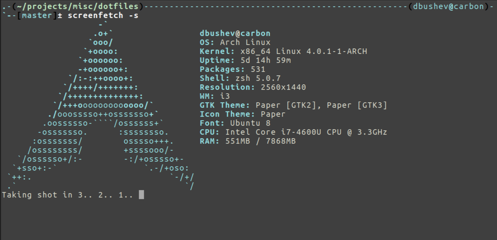
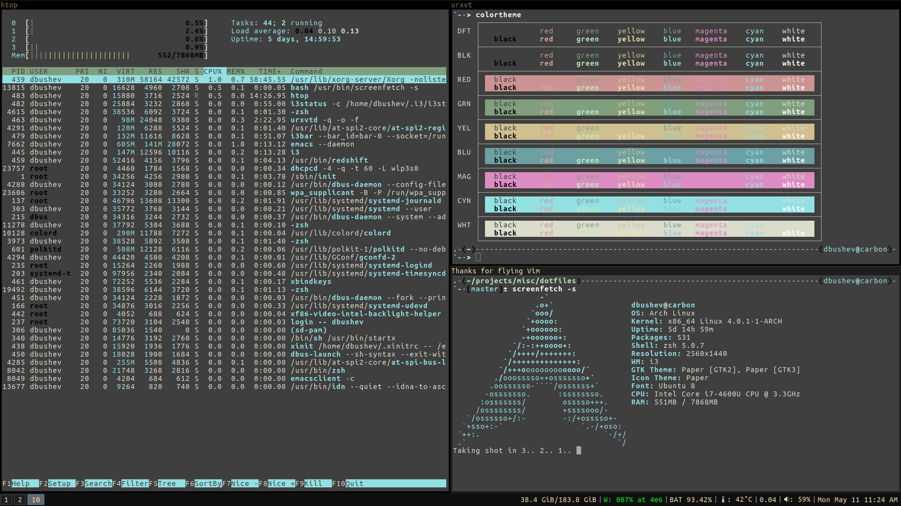
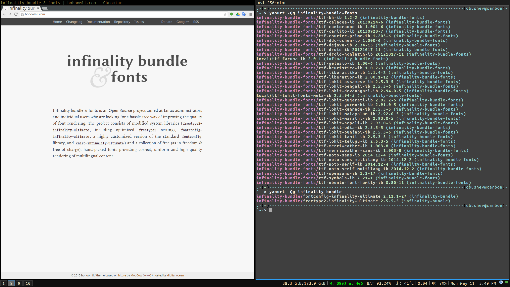

dotfiles
========

    .-(~/projects/misc/dotfiles)----------------------------------(dbushev@carbon)-
    `--[master]± screenfetch
                       -`
                      .o+`                 dbushev@carbon
                     `ooo/                 OS: Arch Linux 
                    `+oooo:                Kernel: x86_64 Linux 4.0.1-1-ARCH
                   `+oooooo:               Uptime: 5d 14h 59m
                   -+oooooo+:              Packages: 531
                 `/:-:++oooo+:             Shell: zsh 5.0.7
                `/++++/+++++++:            Resolution: 2560x1440
               `/++++++++++++++:           WM: i3
              `/+++ooooooooooooo/`         GTK Theme: Paper [GTK2], Paper [GTK3]
             ./ooosssso++osssssso+`        Icon Theme: Paper
            .oossssso-````/ossssss+`       Font: Ubuntu 8
           -osssssso.      :ssssssso.      CPU: Intel Core i7-4600U CPU @ 3.3GHz
          :osssssss/        osssso+++.     RAM: 551MB / 7868MB
         /ossssssss/        +ssssooo/-    
       `/ossssso+/:-        -:/+osssso+-  
      `+sso+:-`                 `.-/+oso: 
     `++:.                           `-/+/
     .`                                 `/

## Screenshots




