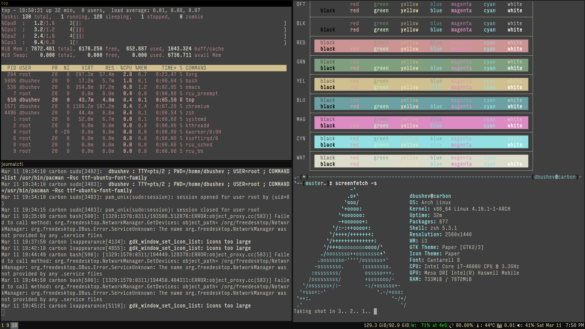

dotfiles
========

```
.-(~)---------------------------------------------------------(dbushev@carbon)-
`--[master]± screenfetch
                   -`
                  .o+`                 dbushev@carbon
                 `ooo/                 OS: Arch Linux
                `+oooo:                Kernel: x86_64 Linux 4.10.1-1-ARCH
               `+oooooo:               Uptime: 1m
               -+oooooo+:              Packages: 877
             `/:-:++oooo+:             Shell: zsh 5.3.1
            `/++++/+++++++:            Resolution: 2560x1440
           `/++++++++++++++:           WM: i3
          `/+++ooooooooooooo/`         GTK Theme: Paper [GTK2/3]
         ./ooosssso++osssssso+`        Icon Theme: Paper
        .oossssso-````/ossssss+`       Font: Ubuntu 8
       -osssssso.      :ssssssso.      CPU: Intel Core i7-4600U CPU @ 3.3GHz
      :osssssss/        osssso+++.     GPU: Mesa DRI Intel(R) Haswell Mobile
     /ossssssss/        +ssssooo/-     RAM: 293MiB / 7872MiB
   `/ossssso+/:-        -:/+osssso+-
  `+sso+:-`                 `.-/+oso:
 `++:.                           `-/+/
 .`                                 `/
```

## Fonts

Fonts from `fonts-meta` AUR bundle

```
$ yaourt -Qs 'fonts-meta'
local/fonts-meta-base 1-2
    Base font collection meta package, ported from Infinality.
local/fonts-meta-extended-lt 2-2
    Extended font collection meta package, ported from Infinality (lite version).
```

## Screenshots


